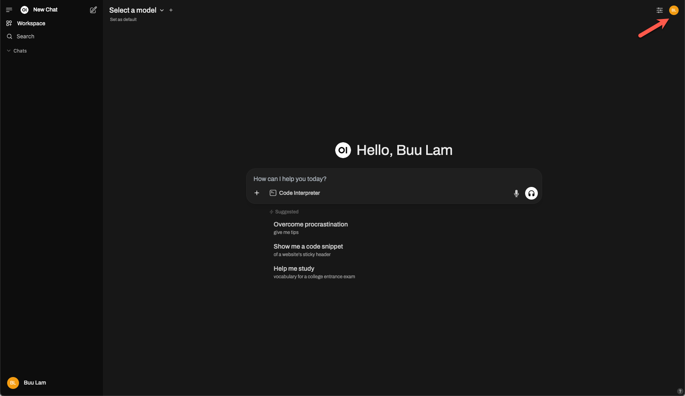
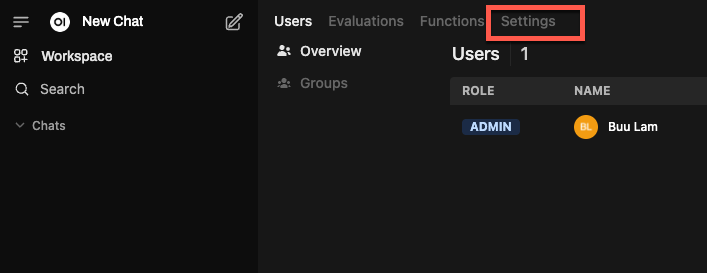
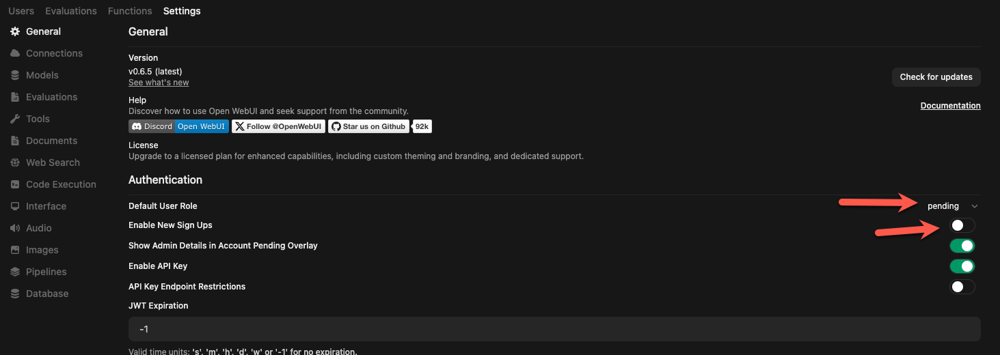

# Preparing the server

## Install Docker Engine
The simplest way to install Open WebUI is via Docker. If you do not have this installed, follow the instructions here:
https://docs.docker.com/engine/install/

## Install Ollama (Optional)
Ollama is a simple installation. Here are guides organized by operating system: [Ollama Basics](/1_text_labs/ollama_basics/readme.md)

## Install Open WebUI via Docker
For reference, the instructions can be found here: https://docs.openwebui.com/getting-started/quick-start/

This lab will still outline the steps in order to guide you specifically towards the intended outcomes, however, please refer to the official documentation should you run into an issue.

``` terminal
docker pull ghcr.io/open-webui/open-webui:main
```
Result
``` terminal
main: Pulling from open-webui/open-webui
8a628cdd7ccc: Pull complete 
2a47a8c4fd5c: Pull complete 
9c538fc35491: Pull complete 
47bbb0afa7fe: Pull complete 
782acb99e453: Pull complete 
4f4fb700ef54: Pull complete 
b7915144f9c7: Pull complete 
633be3c6bab0: Pull complete 
266a80d83771: Pull complete 
7b4a3fa111d1: Pull complete 
693caf783e3a: Pull complete 
e549cfb1e9e7: Pull complete 
5beb63436aec: Pull complete 
c1b8d4819be2: Pull complete 
fc709d98d8b0: Pull complete 
Digest: sha256:3039364e82311729e0737bf9bdd877e6b0aa84a02a7b4f220506b28c8d3181cb
Status: Downloaded newer image for ghcr.io/open-webui/open-webui:main
ghcr.io/open-webui/open-webui:main
```

``` terminal
docker run -d -p 3000:8080 -v open-webui:/app/backend/data --name open-webui ghcr.io/open-webui/open-webui:main
```

Result
``` terminal
e1d5c496862d094c0e773d596e71b1d5acaecc135f8d6e50df7d25ad7c19994b

user@hostname:~$ docker ps

CONTAINER ID   IMAGE                                COMMAND           CREATED          STATUS                             PORTS                                         NAMES
e1d5c496862d   ghcr.io/open-webui/open-webui:main   "bash start.sh"   50 seconds ago   Up 49 seconds (health: starting)   0.0.0.0:3000->8080/tcp, [::]:3000->8080/tcp   open-webui
```

You should now be able to open the page by visiting the IP or hostname of the server that you installed it on via TCP port 3000

http://server:3000

From here, you will be asked to create the administrator user account.

## Initial server security

Before configuring anything else, check the following settings as they may allow unwanted access to your server.

Click the User icon in the top right



Go to Admin Panel


Go to Settings



Review these settings:

| Setting | State |
|----|----|
| Default User Role | pending |
| Enable New Sign Ups | Disabled |



We will start to configure models that you can access in the [next steps](02-openai.md).