# Configuring OpenAI

By adding an API key from OpenAI, you'll be able to access the models offered from OpenAI but instead of paying for the regular monthly cost, you can pay by the API request. This is a pricing model that will generally be advantageous for individual users and it's a great option for a family AI setup as it should amount to only a few dollars per month.

Obtain an API key by signing up with OpenAI using these instructions:

Then, paste your API key here:

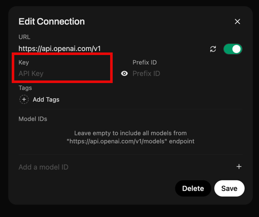

With the API key applied and saved, go to *Settings* and then *Models*.

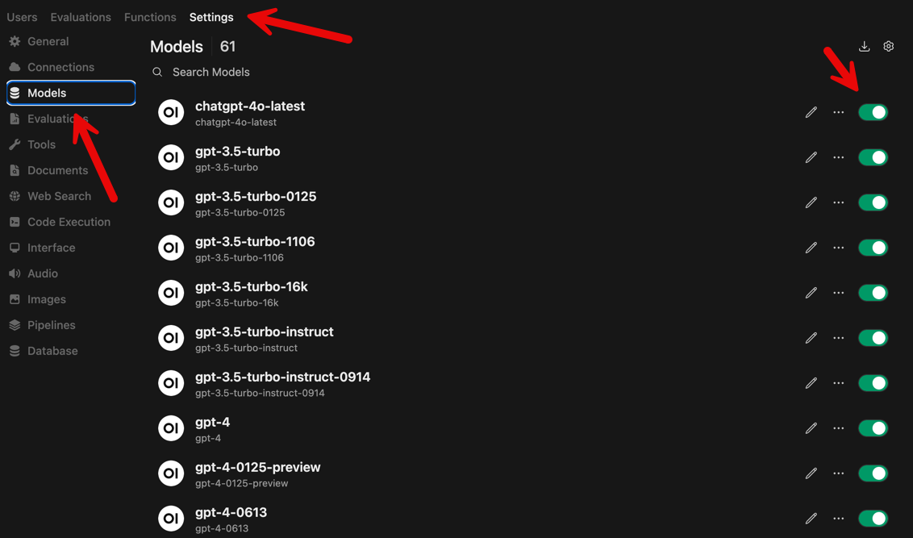

You'll see a very extensive list of models available from OpenAI including ones that are only available via API before being made available on their standard Chat interface.

You can select which ones should be made available and there are also options to do role based access and allow access based on group membership.

For example, I can click to edit this first model:

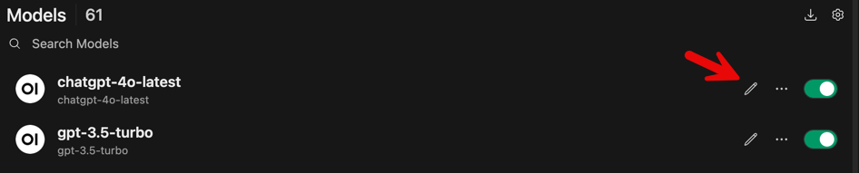

From here, you can make it Public and/or you can add a Group for access.

We'll create a Test User and a put them into a group.

To create a test user, go to Users and click the + to create a new user.

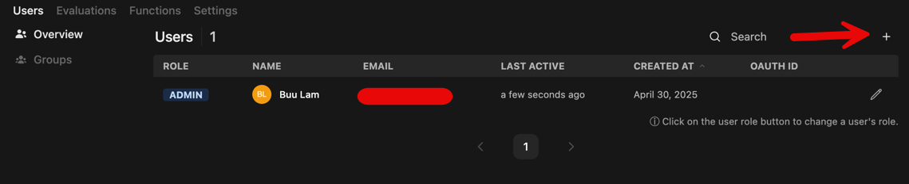

Enter the requested details for *Full Name*, *Email*, and *Description*.

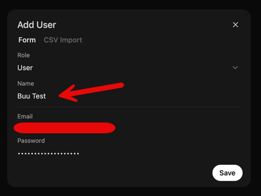

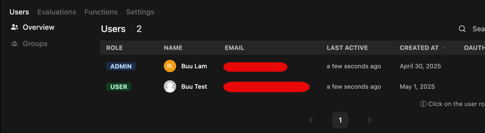

Then, create a group by clicking *Users* and then *Groups*. Then *Create Group*

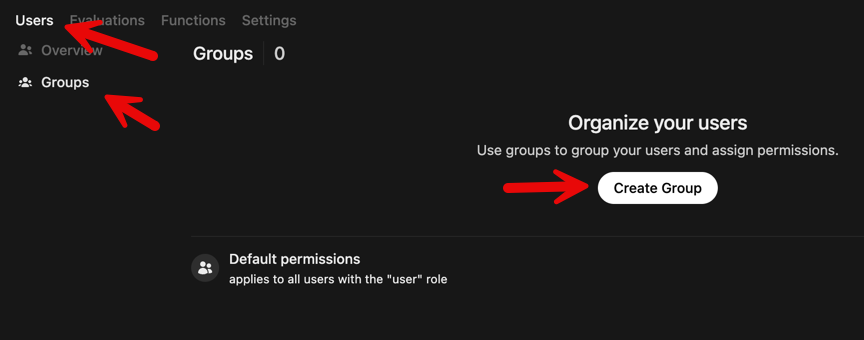

Then enter the group *Name* and optional Description

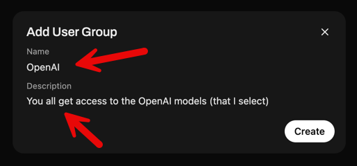

With the group created, you can now add the test user to the group.

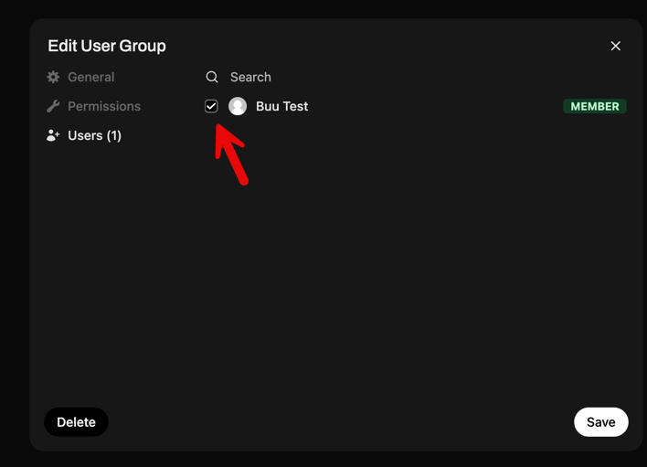

You can now add this group to a model for access.

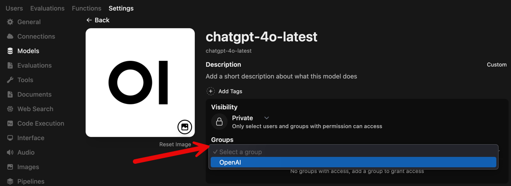

And now you should be able to access the OpenAI models and start prompting.

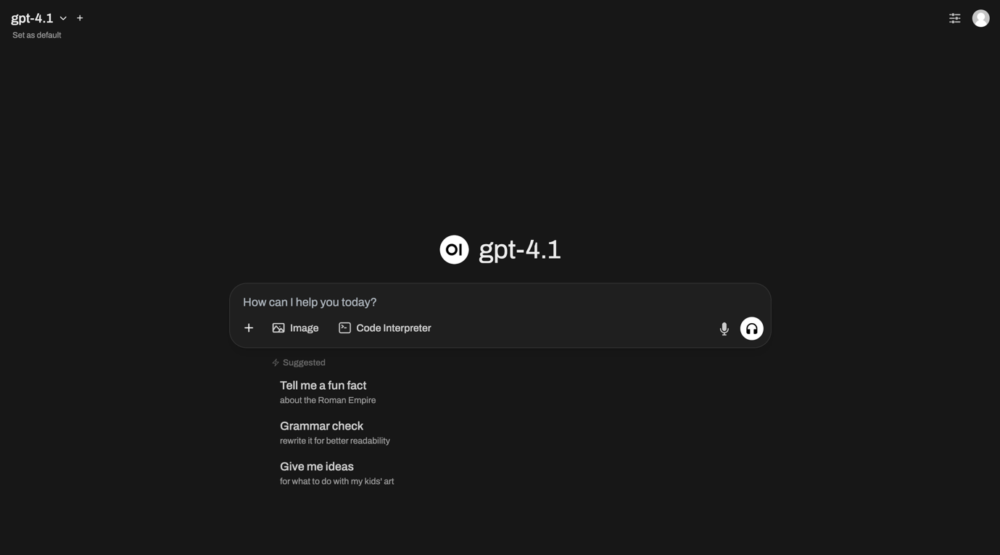

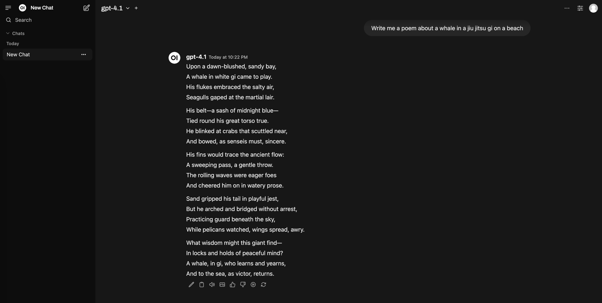]

This is the end of this portion of the lab. Return to the [start](README.md) of the lab to see if there are other labs you'd like to explore with Open WebUI.