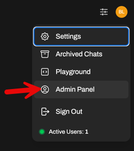
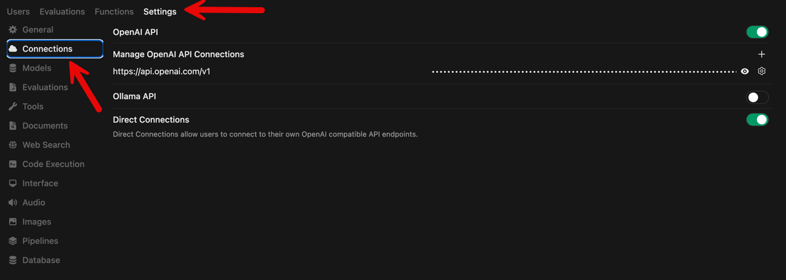
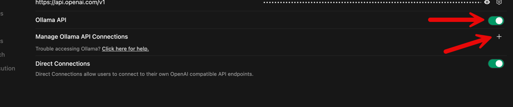
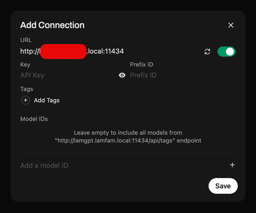
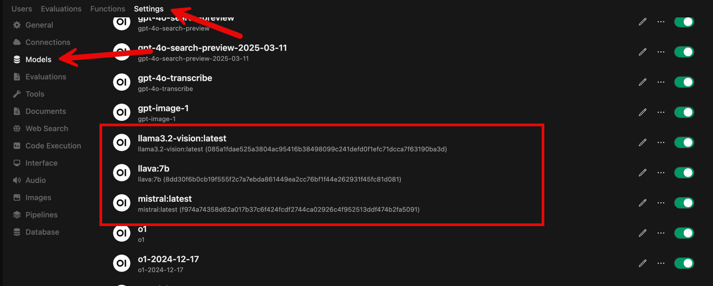
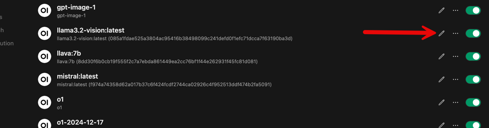
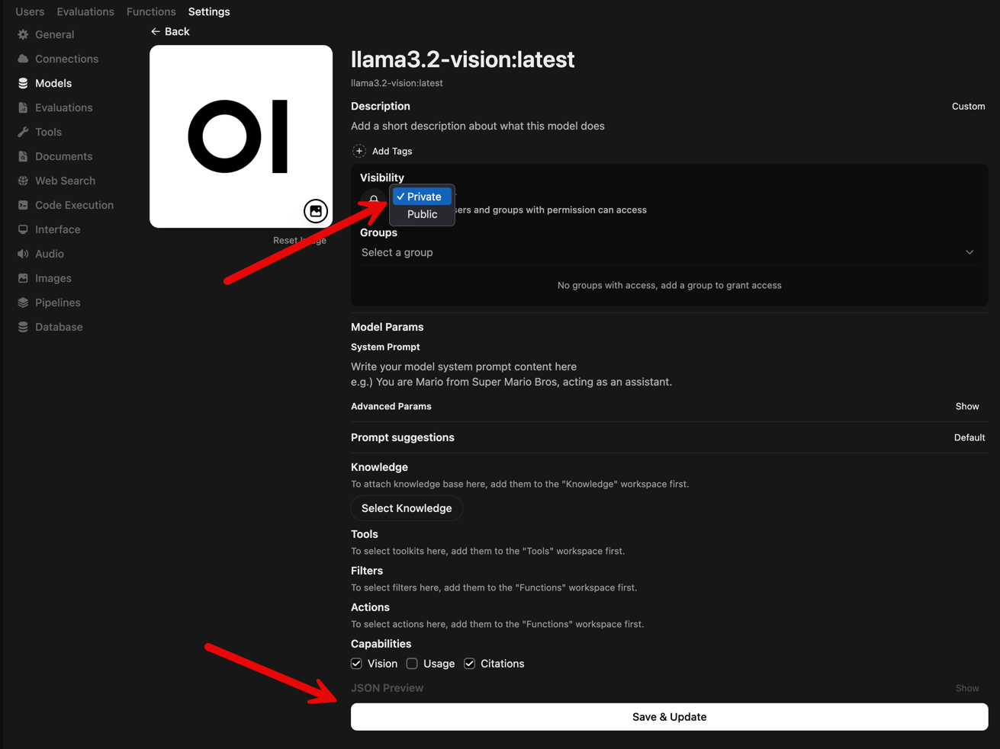
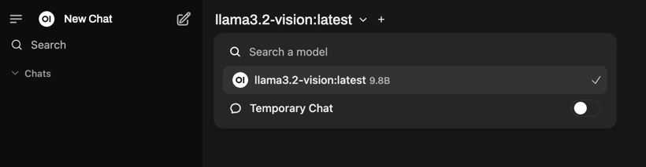

---

# Adding your local Ollama instance

Ollama is free software that allows you to host models local to your environment. In this lab, it is expected that you already have it install. There is another set of labs that walk you through this. [Ollama Basics](../ollama_basics/readme.md)

With that installed, from the Open WebUI Admin settings, you can add it as a Connection.





Enable the Ollama API feature and click the + to add a the server details.



Fill in the server details and click Save. Your Ollama endpoint is likely something like

``` code
http://nameorIPofollamaserver:11434
```



Go to the Models listing. You should now see the models that are served by Ollama.



You can alter the settings of the individual models.



You can set the visibility of the model and click Save.



You should now be able to see the model in your list.



That is the end of this lab. Head back to the [start](README.md) of this lab to see if there are other options you want to try with Open WebUI.