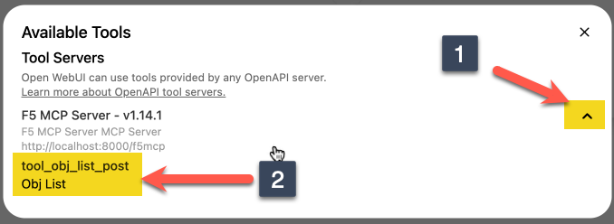

---

# Model Context Protocol (MCP)

The Model Context Protocol (MCP) represents a fundamental shift in how AI systems interact with the world 
beyond their training data. Developed by Anthropic as an open standard, MCP provides a unified interface 
that allows large language models to connect to external tools, databases, APIs, and services in real-time. 

Rather than relying solely on their static knowledge cutoffs, AI models equipped with MCP can dynamically 
access current information, execute code, manipulate files, query databases, and interact with complex 
systems like network infrastructure, cloud services, or enterprise applications. What makes MCP particularly 
powerful is its standardized approach - developers can create MCP servers that expose specific capabilities 
(like interacting with a BIG-IP integration in this lab), and any MCP-compatible AI system can immediately 
leverage those tools without custom integrations. This creates an ecosystem where AI assistants can seamlessly 
transition from answering questions to taking concrete actions, transforming them from passive information 
sources into active operational partners capable of real-world system administration, data analysis, and 
automation tasks.

## What you're building

In this lab, you'll extend your Open WebUI / Ollama environment to include the use of local MCP servers. I've 
been using Anthropic's Claude with the Docker MCP toolkit on my Mac, but given that Claude is a remote model, 
I don't really want to share credentials. From Open WebUI, you can connect to tools a couple different ways.

1. Python scripts hosted within the Open WebUI context
2. Using mcpo, which stands for MCP-to-OpenAPI proxy server

We're pursuing option 2 in this lab. Mcpo acts as an intermediary that manages connections between Open WebUI 
and multiple MCP servers, and can handle authentication, routing, and protocol translation. When prompting the 
AI model to perform a task that requires external tools, the request flows from Open WebUI to the local Ollama 
model instance for natural language processing, then back to Open WebUI which determines if external tools are 
needed. If so, the request is forwarded to mcpo, which routes it to the appropriate MCP server - in this case, 
the F5 MCP server that can interact with BIG-IP systems. The MCP server executes the requested action, returns 
structured data to MCPO, which then passes it back through Open WebUI and the LLM to be presented as natural 
language responses. The F5 MCP server in this lab is dead simple with a single tool to return the list of 
objects (like virtuals, pools, rules, etc) or the specific oject type by name.

The environment looks like this architecturally:


## Installing and validating mcpo and the test MCP server

1. Clone the [f5-mcp repo](https://github.com/f5-rahm/f5-mcp) to the system where your Open WebUI server is running. 

> [!IMPORTANT]
> If Open WebUI is running in docker, make sure that you update it or the cloned repo to make sure the services are 
> all in the same docker network. For example, I created a docker network called 'labnet' for all of my services to 
> share, and I reference that in my docker compose files. If open WebUI is not in docker, you'll likely need to use 
> localhost later for the mcp server you add instead of the f5mcp container name.

```
git clone https://github.com/f5-rahm/f5-mcp.git
```

result
```
Cloning into 'f5-mcp'...
remote: Enumerating objects: 26, done.
remote: Counting objects: 100% (26/26), done.
remote: Compressing objects: 100% (23/23), done.
remote: Total 26 (delta 2), reused 24 (delta 1), pack-reused 0 (from 0)
Receiving objects: 100% (26/26), 14.21 KiB | 606.00 KiB/s, done.
Resolving deltas: 100% (2/2), done.
```

2. Type **cd f5-mcp** to change into the cloned directory. The .env files need to be updated for your environment (and possibly the compose.yaml file depending on your docker 
networking setup). The mcpo API key is in the top level .env file, and your BIG-IP information is in the f5mcp 
directory file as shown below.

```
f5-mcp % cat .env
MCPO_API_KEY=SUPERSECRETAPIKEYHERE

f5-mcp % cat f5mcp/.env
F5_HOST="your bigip ip/hostname"
F5_USER="your bigip username"
F5_PASS="your bigip password"
```

3. Once those files are updated, bring your mcpo and f5mcp services up with docker compose.

```
docker compose up
```

result
```
f5-mcp % docker compose up
[+] Building 1.4s (15/15) FINISHED
 => [internal] load local bake definitions                                                                                                                                        0.0s
 => => reading from stdin 369B                                                                                                                                                    0.0s
 => [internal] load build definition from Dockerfile                                                                                                                              0.0s
 => => transferring dockerfile: 298B                                                                                                                                              0.0s
 => [internal] load metadata for docker.io/library/python:3.11-slim                                                                                                               0.7s
 => [auth] library/python:pull token for registry-1.docker.io                                                                                                                     0.0s
 => [internal] load .dockerignore                                                                                                                                                 0.0s
 => => transferring context: 2B                                                                                                                                                   0.0s
 => [1/7] FROM docker.io/library/python:3.11-slim@sha256:a0939570b38cddeb861b8e75d20b1c8218b21562b18f301171904b544e8cf228                                                         0.0s
 => => resolve docker.io/library/python:3.11-slim@sha256:a0939570b38cddeb861b8e75d20b1c8218b21562b18f301171904b544e8cf228                                                         0.0s
 => [internal] load build context                                                                                                                                                 0.0s
 => => transferring context: 1.14kB                                                                                                                                               0.0s
 => CACHED [2/7] WORKDIR /app                                                                                                                                                     0.0s
 => CACHED [3/7] RUN apt-get update && apt-get install -y     && rm -rf /var/lib/apt/lists/*                                                                                      0.0s
 => CACHED [4/7] COPY requirements.txt .                                                                                                                                          0.0s
 => CACHED [5/7] RUN pip install --no-cache-dir -r requirements.txt                                                                                                               0.0s
 => [6/7] COPY main.py .                                                                                                                                                          0.0s
 => [7/7] COPY .env .                                                                                                                                                             0.0s
 => exporting to image                                                                                                                                                            0.5s
 => => exporting layers                                                                                                                                                           0.0s
 => => exporting manifest sha256:a840fd82f3e51feda65467214afc273a6f308e39ac09bb5231e23c7901f644a0                                                                                 0.0s
 => => exporting config sha256:a9b1ee5ff09d0806a72c10bc8fa2e7d9abe81d053824936cbe58094707b6baea                                                                                   0.0s
 => => exporting attestation manifest sha256:8267cffd31f02bb8f2caa5e91360e5c522ee9213a5cd8124196242119d190562                                                                     0.0s
 => => exporting manifest list sha256:2ab8025666524cc322d1c456887df919492b5fd73ac88a3f983db8467384fc9f                                                                            0.0s
 => => naming to docker.io/library/f5-mcp-f5mcp:latest                                                                                                                            0.0s
 => => unpacking to docker.io/library/f5-mcp-f5mcp:latest                                                                                                                         0.4s
 => resolving provenance for metadata file                                                                                                                                        0.0s
[+] Running 3/3
 ✔ f5mcp            Built                                                                                                                                                         0.0s
 ✔ Container f5mcp  Created                                                                                                                                                       0.1s
 ✔ Container mcpo   Created                                                                                                                                                       0.0s
Attaching to f5mcp, mcpo
f5mcp  |
f5mcp  |
f5mcp  | ╭────────────────────────────────────────────────────────────────────────────╮
f5mcp  | │                                                                            │
f5mcp  | │        _ __ ___  _____           __  __  _____________    ____    ____     │
f5mcp  | │       _ __ ___ .'____/___ ______/ /_/  |/  / ____/ __ \  |___ \  / __ \    │
f5mcp  | │      _ __ ___ / /_  / __ `/ ___/ __/ /|_/ / /   / /_/ /  ___/ / / / / /    │
f5mcp  | │     _ __ ___ / __/ / /_/ (__  ) /_/ /  / / /___/ ____/  /  __/_/ /_/ /     │
f5mcp  | │    _ __ ___ /_/    \____/____/\__/_/  /_/\____/_/      /_____(*)____/      │
f5mcp  | │                                                                            │
f5mcp  | │                                                                            │
f5mcp  | │                                FastMCP  2.0                                │
f5mcp  | │                                                                            │
f5mcp  | │                                                                            │
f5mcp  | │                🖥️  Server name:     F5 MCP Server                           │
f5mcp  | │                📦 Transport:       Streamable-HTTP                         │
f5mcp  | │                🔗 Server URL:      http://0.0.0.0:8081/mcp                 │
f5mcp  | │                                                                            │
f5mcp  | │                🏎️  FastMCP version: 2.12.3                                  │
f5mcp  | │                🤝 MCP SDK version: 1.14.1                                  │
f5mcp  | │                                                                            │
f5mcp  | │                📚 Docs:            https://gofastmcp.com                   │
f5mcp  | │                🚀 Deploy:          https://fastmcp.cloud                   │
f5mcp  | │                                                                            │
f5mcp  | ╰────────────────────────────────────────────────────────────────────────────╯
f5mcp  |
f5mcp  |
f5mcp  | [09/24/25 21:42:38] INFO     Starting MCP server 'F5 MCP Server'  server.py:1572
f5mcp  |                              with transport 'http' on
f5mcp  |                              http://0.0.0.0:8081/mcp
f5mcp  | INFO:     Started server process [1]
f5mcp  | INFO:     Waiting for application startup.
f5mcp  | INFO:     Application startup complete.
f5mcp  | INFO:     Uvicorn running on http://0.0.0.0:8081 (Press CTRL+C to quit)
mcpo   | 2025-09-24 21:42:38,703 - INFO - Starting MCPO Server...
mcpo   | 2025-09-24 21:42:38,703 - INFO -   Name: MCP OpenAPI Proxy
mcpo   | 2025-09-24 21:42:38,703 - INFO -   Version: 1.0
mcpo   | 2025-09-24 21:42:38,703 - INFO -   Description: Automatically generated API from MCP Tool Schemas
mcpo   | 2025-09-24 21:42:38,703 - INFO -   Hostname: 3df19a69ab08
mcpo   | 2025-09-24 21:42:38,703 - INFO -   Port: 8000
mcpo   | 2025-09-24 21:42:38,703 - INFO -   API Key: Not Provided
mcpo   | 2025-09-24 21:42:38,703 - INFO -   CORS Allowed Origins: ['*']
mcpo   | 2025-09-24 21:42:38,703 - INFO -   Path Prefix: /
mcpo   | 2025-09-24 21:42:38,703 - INFO - Loading MCP server configurations from: /app/config/config.json
mcpo   | 2025-09-24 21:42:38,704 - INFO - Configuring MCP Servers:
mcpo   | 2025-09-24 21:42:38,704 - INFO - Enabling hot reload for config file: /app/config/config.json
mcpo   | 2025-09-24 21:42:38,704 - INFO - Started watching config file: /app/config/config.json
mcpo   | 2025-09-24 21:42:38,704 - INFO - Uvicorn server starting...
mcpo   | INFO:     Started server process [1]
mcpo   | INFO:     Waiting for application startup.
mcpo   | 2025-09-24 21:42:38,718 - INFO - Initiating connection for server: 'f5mcp'...
f5mcp  | INFO:     172.18.0.5:35014 - "POST /mcp HTTP/1.1" 200 OK
mcpo   | 2025-09-24 21:42:38,764 - INFO - HTTP Request: POST http://f5mcp:8081/mcp "HTTP/1.1 200 OK"
mcpo   | 2025-09-24 21:42:38,765 - INFO - Negotiated protocol version: 2025-06-18
f5mcp  | INFO:     172.18.0.5:35024 - "POST /mcp HTTP/1.1" 202 Accepted
mcpo   | 2025-09-24 21:42:38,767 - INFO - HTTP Request: POST http://f5mcp:8081/mcp "HTTP/1.1 202 Accepted"
f5mcp  | INFO:     172.18.0.5:35040 - "POST /mcp HTTP/1.1" 200 OK
mcpo   | 2025-09-24 21:42:38,770 - INFO - HTTP Request: POST http://f5mcp:8081/mcp "HTTP/1.1 200 OK"
mcpo   | 2025-09-24 21:42:38,771 - INFO - Successfully connected to 'f5mcp'.
mcpo   | 2025-09-24 21:42:38,771 - INFO -
mcpo   | --- Server Startup Summary ---
mcpo   | 2025-09-24 21:42:38,771 - INFO - Successfully connected to:
mcpo   | 2025-09-24 21:42:38,771 - INFO -   - f5mcp
mcpo   | 2025-09-24 21:42:38,771 - INFO - --------------------------
mcpo   |
mcpo   | INFO:     Application startup complete.
mcpo   | INFO:     Uvicorn running on http://0.0.0.0:8000 (Press CTRL+C to quit)
```

You can see toward the bottom of the logs that mcpo has successfully connected to the f5mcp server. Looking good!

4. In your browser, go to https://localhost:8000/docs. You should see this screen:


5. Click on the f5cmp link in the highlighted area and you should see this screen:


6. Expand the highlighted area by clicking the down arrow at the far right and that will expose 
the details on what the f5mcp tool expects. In this case it expects an **obj_type** which for this 
lab should be virtual, pool, or rule and optionally an **obj_name**. Click on the try it out button 
highlighted in the picture below.


7. The box with the request body will now be editable. Remove the obj_name and the trailing comma 
on the obj_type line, then replace string with pool and hit the execute button. Your screen should look 
like this before you hit execute:


8. After hitting execute, you should see in teh response body the list of your BIG-IP pool names.


Huzzah! This confirms that your mcp proxy is functioning properly.

## Integrating mcpo into Open WebUI

1. Open your browser and launch your Open WebUI instance, mine is at http://localhost:3000. Click your profile 
icon in the upper right corner, then click settings.


2. In the settings window, click teh External Tools in the left bar, then click the **+** to the far left to add a tool.


3. In the Add Connection dialog, set the URL to your mcpo server (localhost:8000) and the trailing URI to your 
mcp server (/f5mcp). Also set your mcpo api key from the .env file to the Bearer value (SUPERSECRETAPIKEYHERE) 
in my case. Then click save.


4. Exit out of savings, then in your chat window, click the integrations and activate the F5 MCP Server tool.


5. Click on the tools icon.


6. Click the down arrow to the right and then review the tools available to the model. You can see that our 
listing tool for BIG-IP objects is present.



7. Close out of the available tools dialog. Now in the chat prompt window, ask the model to list the pools available 
on your BIG-IP. The tool itself needs an object type and optionally an object name. The tool for this lab is very 
simple, so just use virtual, pool, or rule for success. You might need to be explicit with your instructions with 
these smaller models, and it might take a prompt or two to get there. My working prompt for the list (after a couple 
failures) and a follow up prompt for the specifics of one pool are below.


Huzzah! The MCP server here is quite dumb and created only to keep the scope very small and focused on building out 
an AI infrastructure in your home lab. For BIG-IP specifically, one of our [DevCentral](https://community.f5.com) 
MVP's [mihaic](https://community.f5.com/users/mihaic/72830) created a more robust CRUD 
[MCP server for BIG-IP](https://community.f5.com/kb/codeshare/f5-mcpmodel-context-protocol-server/340704). If you 
have a more powerful model like Anthropic's Claude running locally that really understands BIG-IP, you can probably 
just use a curl tool and build out an entire application service through a chat bot!

## Conclusion

Congrats! You've deployed your own MCP server with the mcpo proxy for Open WebUI. You can add more MCP servers 
by editing the mcpo-config.json in the repo directory you cloned and then doing a **docker compose restart** and 
then adding them individually to your tool set in your Open WebUI settings. If you switch models, you need to 
re-active your tools in each chat session.


