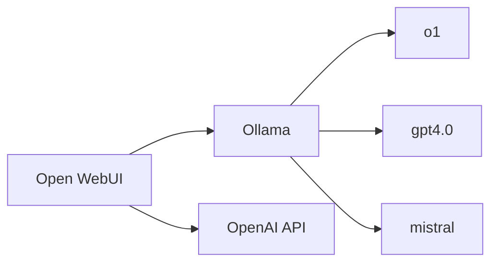

---
# LLM server and Open WebUI

This lab will guide you through install Open WebUI, a simple to use web front end for interacting with AI models for both text and images.

The web front end is meant to be run from a "server" of your own. In this lab, the models can either be run locally using Ollama and/or from OpenAI through the use of their APIs.

## Practical usage

Aside from the learning aspect of this, you could look at using this as a method to make AI services available to your household. There are interesting benefits this way:

* Save money from subscribing to AI chat services by consolidating individual family members subscriptions. It is likely that using an AI service's API will be far cheaper than a single subscription, let alone if you have mutiple people in your household using services.
* Keep an eye on what your kids are doing with AI with the ability to monitor their chats.
* Experiment with the latest models quickly as you can switch models quickly. As well, services like OpenAI typically will have their latest models available via API before their general subscription service.

## Lab environment

For this lab you will need:
* 1x Ubuntu linux server
  * Docker installed
  * If only installing Open WebUI, this could be as small as a Raspberry Pi
  * If running Ollama, a general purpose CPU is fine but a GPU is recommended if using regularly
* API key from OpenAI if you want to use those services
  * See [this link](https://platform.openai.com/docs/overview) for details

## Lab architecture

| Service | Description | Jump to Lab Guide |
|---------|-------------|-------------------|
| Open WebUI | Web front end and router of AI models | [Installing Open WebUI](01-openwebui.md)
| Ollama | Local LLM runtime | [Connecting to OpenAI via API](02-openai.md)
| OpenAI API | LLM service | [Connecting to your local Ollama](03-ollama.md)

Proceed to this lab to install [Open WebUI](01-openwebui.md)

Once Open WebUI is installed, you can chose one of the services from the above table to add AI models.