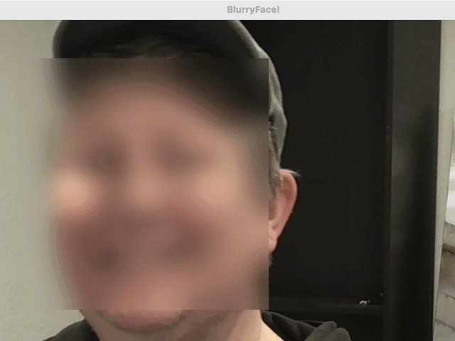

# Using OpenCV and MediaPipe for facial recognition

In this lab, we'll use OpenCV and MediaPipe along with your built-in or external webcam to first track your mood, then just OpenCV to blur your face.

## Mood Detection Workflow:
1. Images from the webcam are continuously captured
2. For each image
   1. convert from BGR to RGB for MediaPipe
   2. MediaPipe processes the image to detect facial landmarks
   3. If any are found, the detect expression function is called
   4. The function evaluates two landmarks on my mouth and returns an expression
   5. OpenCV draws a circle and text with color/text of the found expression


I have included a lot more of the known landmarks (there are many more that aren't named publicly) you can play with. I found in my quick testing that there isn't much difference (when using only a couple landmarks on my eyebrows and mouth) between pensive and angry, so I pulled angry out in my example. Turns out I guess that I have resting jerk face! I used the commented out print statement to find the right measurement for my conditional in the detect_expression function.


```python
import cv2
import mediapipe as mp

mp_face_mesh = mp.solutions.face_mesh
face_mesh = mp_face_mesh.FaceMesh(static_image_mode=False)
mood_color = {
    "smiling": (0, 255, 0),
    "pensive": (200, 80, 80)
}
landmark_names = {
    # Mouth
    61: "mouth_left",
    291: "mouth_right",
    13: "upper_lip",
    14: "lower_lip",
    0: "lip_center_top",
    17: "lip_center_bottom",
    78: "mouth_upper_inner_left",
    308: "mouth_upper_inner_right",
    87: "mouth_lower_inner_left",
    318: "mouth_lower_inner_right",
    # Eyes
    33: "left_eye_outer_corner",
    133: "left_eye_inner_corner",
    159: "left_eye_bottom",
    145: "left_eye_top",
    362: "right_eye_outer_corner",
    263: "right_eye_inner_corner",
    386: "right_eye_bottom",
    374: "right_eye_top",
    # Eyebrows
    70: "left_eyebrow_inner",
    63: "left_eyebrow_middle",
    105: "left_eyebrow_outer",
    336: "right_eyebrow_inner",
    296: "right_eyebrow_middle",
    334: "right_eyebrow_outer",
    # Nose
    1: "nose_tip",
    2: "nose_bridge",
    98: "nose_left",
    327: "nose_right",
    168: "nose_bottom_center",
    # Face and Jaw
    10: "chin_center",
    234: "jaw_left",
    454: "jaw_right",
    152: "chin_bottom",
    199: "chin_top",
    234: "jawline_left",
    454: "jawline_right",
}


def detect_expression(landmarks):
    left_mouth = landmark_names.get('mouth_left')
    right_mouth = landmark_names.get('mouth_right')
    mouth_width = right_mouth.x - left_mouth.x

    # print(f"Mouth width: {mouth_width:.3f}")

    if mouth_width > 0.060:
        return "smiling"
    else:
        return "pensive"

cap = cv2.VideoCapture(0)
while cap.isOpened():
    ret, frame = cap.read()
    if not ret:
        print("Failed to get frame")
        break

    image_rgb = cv2.cvtColor(frame, cv2.COLOR_BGR2RGB)
    results = face_mesh.process(image_rgb)

    if results.multi_face_landmarks:
        for face_landmarks in results.multi_face_landmarks:
            landmarks = face_landmarks.landmark
            expression = detect_expression(landmarks)
            color = mood_color[expression]

            h, w, _ = frame.shape
            cv2.circle(frame, (1050, 50), 20, color, -1)
            cv2.putText(frame, expression, (1080, 50), cv2.FONT_HERSHEY_SIMPLEX, 0.8, color, 2)

    cv2.imshow("Jason's Mood", frame)
    if cv2.waitKey(5) & 0xFF == ord('q'):
        break

cap.release()
cv2.destroyAllWindows()
```

## Face Blur Workflow

1. Load the model
2. Images from the webcam are continuously captured
3. For each image
   1. convert from BGR to grayscale for easier detection
   2. OpenCV processes the image to detect a face
   3. If any are found, a facial frame is constructed and blurred



```python
import cv2
import os

# Load the model
cv2_base_dir = os.path.dirname(os.path.abspath(cv2.__file__))
haar_model_path = os.path.join(cv2_base_dir, 'data', 'haarcascade_frontalface_default.xml')
if not os.path.isfile(haar_model_path):
    haar_model_path = cv2.data.haarcascades + 'haarcascade_frontalface_default.xml'
face = cv2.CascadeClassifier(haar_model_path)
if face.empty():
    raise ValueError("Error: Could not load face cascade classifier. Check the file path.")

cap = cv2.VideoCapture(0)

while True:
    ret, frame = cap.read()
    if not ret:
        print("Failed to grab frame")
        break

    gray = cv2.cvtColor(frame, cv2.COLOR_BGR2GRAY)
    faces = face.detectMultiScale(gray, 1.2, 4)
    for (x, y, w, h) in faces:
        face_roi = frame[y:y + h, x:x + w]
        gaussian_blur = cv2.GaussianBlur(face_roi, (99, 99), 0)
        frame[y:y + h, x:x + w] = gaussian_blur

    if len(faces) == 0:
        cv2.putText(frame, 'Face not found...', (20, 50), cv2.FONT_HERSHEY_COMPLEX, 1, (0, 0, 255))

    cv2.imshow('BlurryFace!', frame)

    if cv2.waitKey(5) & 0xFF == ord('q'):
        break

cap.release()
cv2.destroyAllWindows()
```

## About OpenCV

[OpenCV](https://opencv.org) "is an open source computer vision and machine learning software library...built to provide a common infrastructure for computer vision applications."

## About MediaPipe

[MediaPipe](https://ai.google.dev/edge/mediapipe/solutions/guide) "provides a suite of libraries and tools for you to quickly apply AI and ML techniques in your applications"
[MediaPipe Github Examples](https://github.com/google-ai-edge/mediapipe-samples/tree/main/examples)


