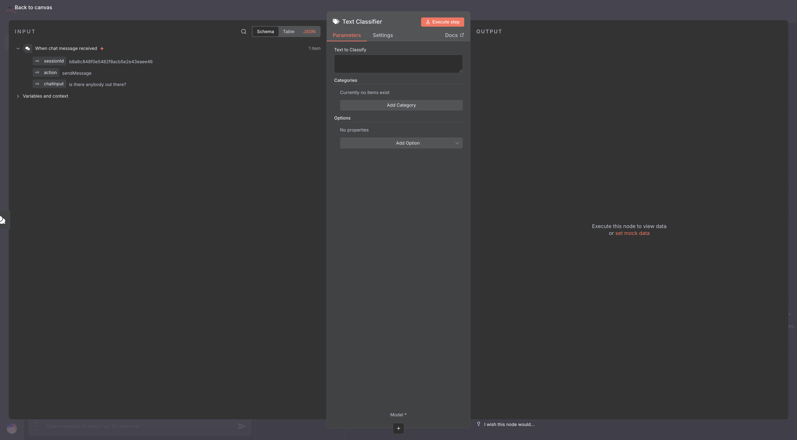
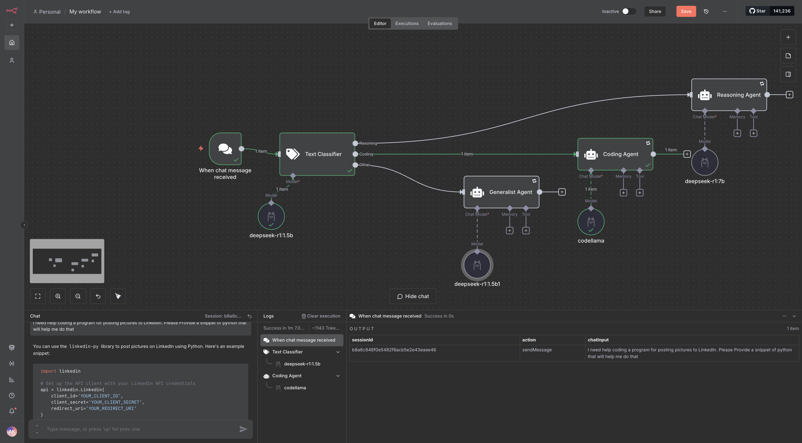

# Goals

By the end of this lab, you will have created a flow that can help organizations to save money on AI spend by selecting the most appropriate model for a given task. A smaller model will classify a user's prmopt and will proxy the prompt on to another model, based on whether or not the prompt was needing reasoning, coding or something else and select a model that is designed for the need, rather than relying on the user understanding which model they should use for which tasks.

This lab assumes that you will be installing your models on one server and your n8n instasllation on its own machine, so that n8n's performance is not impacted by model inference.

## Prerequisites

1. You must have completed our [Ollama Basics lab](ollama_basics) to have an understanding of the installation and use of Ollama.
2. You must have completed one of our [n8n Installation labs](n8n), as well. This will lay the groundwork for the basics.
3. You must have docker installed and running on the machine you're using for the lab. It must also be configured for host networking or you will not be able to access your n8n implementation.

### Steps

1. Set docker to use the NVIDIA runtime on the LLM Server and restart the docker daemon:
`nvidia-ctk runtime configure --runtime=docker; systemctl restart docker`
2. Create a docker volume for persistent functionalityon the LLM Server:
`docker volume create model_data`
3. Install Ollama on the LLM Server using docker:
`docker run -d -v model_data:/root/.ollama -p 11434:11434 --name ollama ollama/ollama`
4. Install the models on the LLM Server that we'll be working with in this lab:
`docker exec ollama ollama pull deepseek-r1:1.5b`
`docker exec ollama ollama pull llama3.2:3b`
`docker exec ollama ollama pull deepseek-r1:7b`
`docker exec ollama ollama pull codellama`
5. Install n8n on the App Server:
`docker volume create n8n_data; docker run -it --rm --name n8n -p 5678:5678 -v n8n_data:/home/node/.n8n docker.n8n.io/n8nio/n8n`
6. Now, it's time to open your browser to <http://192.168.1.233:5678> (but use your host machine's IP address instead of that one) and create an owner account for the instance:
   
7. Click past the customization screen:
   
8. Request your free community license activation key:
   
9. Click usage and plan to enter your license key that should be in your email:
   
10. Click the Enter activation key button and paste your key in from your email:
   

   
11. Create a new workflow by clicking the + button in the top left of the screen and select Workflow from the drop-down:
   
12. Trigger your flow with a chat message. Click the big + in the center of the canvas and select On chat message.
   
13. Add a text classifier node
   

   
14. Classifier Parameters: Click and hold the 'chatInput' object in the JSON input view, then drag it into the 'Text to Classify' box.
   
15. Classifier Parameters: Click the 'Add Category' button. For the Category, enter 'Resoning' and for a description, enter 'If reasoning need is indicated by the chat message, this is the category to assign.'
   
16. Classifier Parameters: Click the 'Add Category' button again. For the Category, enter 'Coding' and for the decription, enter 'If the chat message indicates a need to code or asks for help with computer languages and scripting languages like iRules, JSON or node.js, assign this category.'
   
17. Classifier Parameters: Click the 'Add Option' drop-down, select 'Allow Multiple Cases To Be True' and enable the feature.
   
18. Add Option' drop-down, select 'When No Clear Match' and select the 'Output on Extra, Other Branch' option.
   
19. Classifier Parameters: Click the 'Add Option' drop-down, select 'System Prompt Template' and enter the following text or similar: 'Please classify the text provided by the user into one of the following categories: {categories}, and use the provided formatting instructions below: If they explicitly ask for coding help, do not fail and classify the message as 'Coding'. If they explicitly ask for reasoning help, do not fail and classify the message as 'Reasoning'. Otherwise, Send the  {{ $json.chatInput }} on to the next agent.'
   
20. Classifier Settings: Select 'Retry On Fail', leave the default settings.
   
21. Click the Model '+' at the bootom of your Text Classifier object and add an Ollama model using your Ollama credentials. In the model drop-down, select the model deepseek-r1:1.5b, name it 'deepseek-r1:1.5b' and return to the canvas.
   
   
   
   
22. Click the Reasoning '+' at the right edge of your Text Classifier object and add an AI Agent object. This will immediately open the agent's configuration screen.
   
23. Click the Settings tab, select 'Retry On Fail' and leave the default settings. Rename the node 'Reasoning Agent' and return to canvas.
   
24. Click the Chat Model '+' at the bottom of your Reasoning Agent object and add an Ollama model using your Ollama credentials. In the model drop-down, select the model deepseek-r1:7b, name it 'deepseek-r1:7b' and return to the canvas.
   
25. Click the Coding '+' at the right edge of your Text Classifier object and add an AI Agent object. This will immediately open the agent's configuration screen.
   
26. Click the Settings tab, select 'Retry On Fail' and leave the default settings. Rename the node 'Coding Agent' and return to canvas.
   
27. Click the Chat Model '+' at the bottom of your Coding Agent object and add an Ollama model using your Ollama credentials. In the model drop-down, select the model codellama:latest, name it 'codellama' and return to the canvas.
   
   
28. Click the Other '+' at the right edge of your Text Classifier object and add an AI Agent object. This will immediately open the agent's configuration screen.
   
29. Click the Settings tab, select 'Retry On Fail' and leave the default settings. Rename the node 'Generalist Agent' and return to canvas.
   
30. Click the Chat Model '+' at the bottom of your Other Agent object and add an Ollama model using your Ollama credentials. In the model drop-down, select the model deepseek-r1:1.5b, name it 'deepseek-r1:1.5b' and return to the canvas.
   
   
31. Now, it's time to play. Open your n8n chat interface, if you haven't already and enter some prompts. These will take a bit. Watch how the objects in your flow pass data to one another by clicking on the object and observing the data that is input and output through each step in the flow. Observe how poor prompt engineering yields lessser results. What else do you see happening? Perhaps adjust your system prompt to the Text Classifier's attached model. What happens to your results if you change models on your agents?
   
   
   
   
