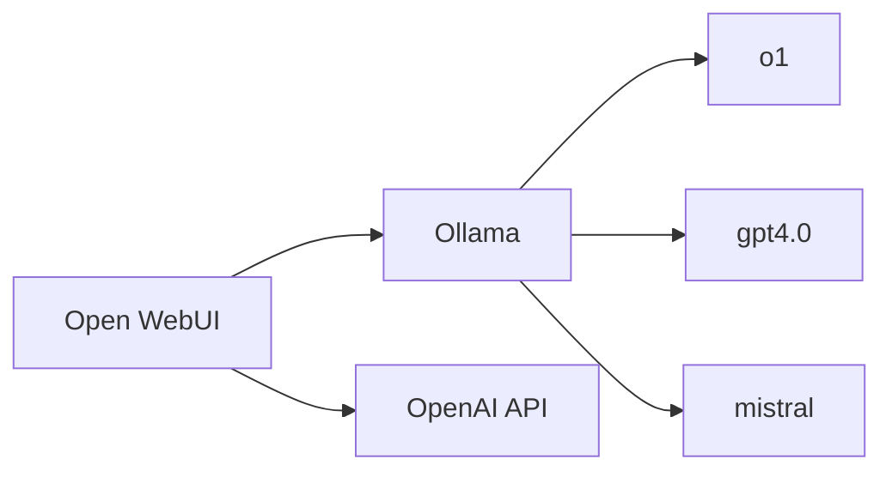

# LLM server and Open WebUI

```mermaid
graph LR

A[Open WebUI] --> B[Ollama]
A --> C[OpenAI API]
B --> D[o1]
B --> E[gpt4.0]
B --> F[mistral]

```

| Service | Description | 
|---------|-------------|
| Open WebUI | Web front end and router of AI models |
| Ollama | Local LLM runtime |
| OpenAI API | LLM service |
