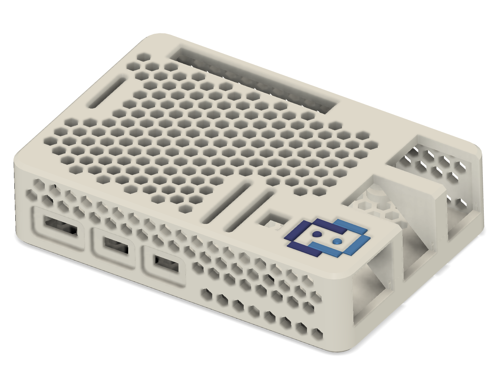
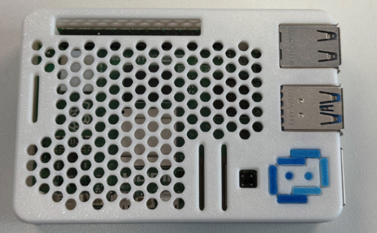

# Print your own Raspberry Pi 5 case

If you are doing one of the labs using a Raspberry Pi and have a 3D printer, here is a case that you might like.

- [STL Files](STL/)
- [Bambu Files](Bambu/)

## Thank you
_____
Thank you to Joe Martin and Glen Willms for their design and prototyping efforts!